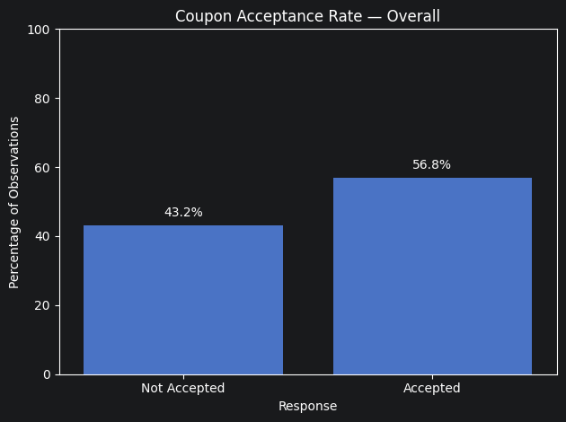
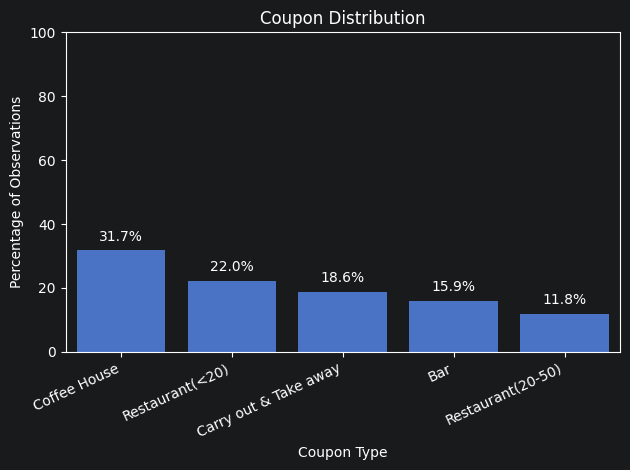
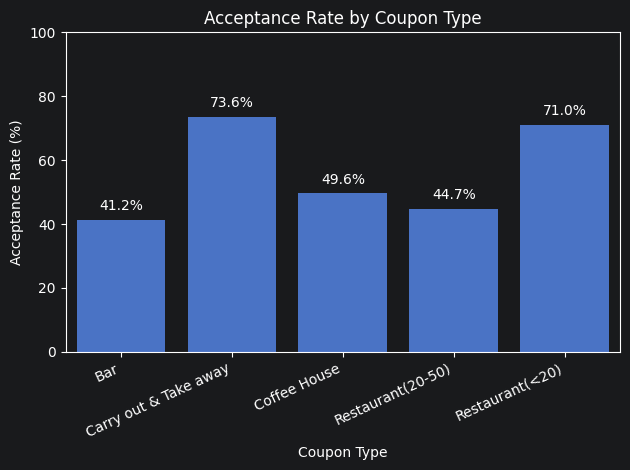
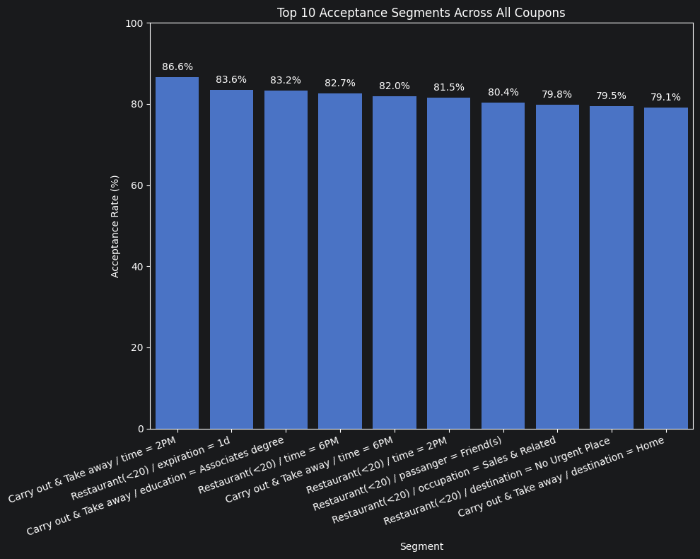

# Assignment 5.1: Will the Customer Accept the Coupon?

## Project Files

- [Jupyter Notebook](prompt.ipynb)
- [Dataset](data/coupons.csv)

## Overview

The goal of this project is to analyze a UCI Machine Learning dataset that comes from a survey conducted by Amazon 
Mechanical Turk. This survey asks a person whether he will drive to a restaurant or coffee shop, and then asks the 
person whether he will accept a coupon.

The final goal of this project, after analyzing the data, is to highlight the differences between drivers who accept 
and reject coupons.

## Procedure

To achieve the goal, we performed a technical analysis on a Jupyter Notebook. From a high level 
the steps were:

1. Prepare the tooling and load the dataset
2. Explore the data to understand the characteristics of the dataset
3. Look for duplicates, missing values and handle them appropriately
4. Perform exploratory data analysis to understand the data
5. Perform data visualization to understand the data

## Results

### Overall Coupon Acceptance Rate

After cleaning the data, we analyzed the Overall Coupon Acceptance Rate, or in other words,
the percentage of customers who accept the coupon, this is shown in the following graph:

Near 60% of the customers accepted the coupon.

### Coupon Types

The most common coupon type are "Coffee House" (32%) and "Restaurant with average expense less than $20 per person" (22%).

### Acceptance per Coupon Type

The 2 groups that have the highest acceptance rate are "Carry out & Take away" (73%) and "Restaurant with average 
expense less than $20 per person" (71%).

### Segments of Acceptance Across All Coupons

If we analyze each coupon type individually, we can see that the characteristics of each coupon type are different.

#### Coffee House

| feature | value | acceptance\_rate | n |
| :--- | :--- | :--- | :--- |
| CoffeeHouse | 4\~8 | 68.244576 | 507 |
| age | below21 | 67.832168 | 143 |
| CoffeeHouse | gt8 | 65.789474 | 342 |
| CoffeeHouse | 1\~3 | 64.729064 | 1015 |
| time | 10AM | 63.434579 | 856 |

### Carry out & Take away

| feature | value | acceptance\_rate | n |
| :--- | :--- | :--- | :--- |
| time | 2PM | 86.602871 | 209 |
| education | Associates degree | 83.248731 | 197 |
| time | 6PM | 81.995134 | 411 |
| destination | Home | 79.126214 | 618 |
| income | $25000 - $37499 | 78.711485 | 357 |

### Restaurant(<20)

| feature | value | acceptance\_rate | n |
| :--- | :--- | :--- | :--- |
| expiration | 1d | 83.553142 | 1289 |
| time | 6PM | 82.657343 | 715 |
| time | 2PM | 81.487102 | 659 |
| passanger | Friend\(s\) | 80.354880 | 789 |
| occupation | Sales & Related | 79.828326 | 233 |

### Restaurant(20-50)

| feature | value | acceptance\_rate | n |
| :--- | :--- | :--- | :--- |
| passanger | Partner | 62.500000 | 136 |
| time | 10AM | 60.747664 | 107 |
| CoffeeHouse | 1\~3 | 55.124654 | 361 |
| time | 2PM | 54.597701 | 174 |
| occupation | Computer & Mathematical | 53.374233 | 163 |

### Bar

| feature | value | acceptance\_rate | n |
| :--- | :--- | :--- | :--- |
| Bar | 4\~8 | 77.551020 | 147 |
| Bar | 1\~3 | 64.643799 | 379 |
| Restaurant20To50 | 4\~8 | 63.063063 | 111 |
| passanger | Friend\(s\) | 56.645570 | 316 |
| occupation | Management | 55.769231 | 104 |

## Top 10 Acceptance Segments Across All Coupons

Merged together, and after removing small segments that are not significant,
we can see that the top 10 acceptance segments across all coupons are:

| feature     | value | acceptance\_rate | n | coupon |
|:------------| :--- | :--- | :--- | :--- |
| time        | 2PM | 86.602871 | 209 | Carry out & Take away |
| expiration  | 1d | 83.553142 | 1289 | Restaurant\(&lt;20\) |
| education   | Associates degree | 83.248731 | 197 | Carry out & Take away |
| time        | 6PM | 82.657343 | 715 | Restaurant\(&lt;20\) |
| time        | 6PM | 81.995134 | 411 | Carry out & Take away |
| time        | 2PM | 81.487102 | 659 | Restaurant\(&lt;20\) |
| passanger   | Friend\(s\) | 80.354880 | 789 | Restaurant\(&lt;20\) |
| occupation  | Sales & Related | 79.828326 | 233 | Restaurant\(&lt;20\) |
| destination | No Urgent Place | 79.458795 | 1626 | Restaurant\(&lt;20\) |
| destination | Home | 79.126214 | 618 | Carry out & Take away |

### Conclusion

The charts show that customers are more likely to accept food-related coupons than bar coupons.

The highest acceptance rates are for:
- Carry out & Take away
- Restaurant(<20)

The charts also show that time matters. Food coupons perform especially well around:
- 2PM
- 6PM

For Bar coupons specifically, the deeper analysis showed that drivers who are already regular customers are more 
likely to accept them, but even then, the acceptance rate is still below Restaurant coupons at lunch or dinner.

### Recommendations

1. Send more food coupons than bar coupons.
2. Focus food coupons around common meal times like 2PM and 6PM.
3. Use bar coupons for customers who already show interest in bars.
4. Keep future analysis simple and compare one coupon type at a time.

### Next Steps

- The next step is to keep exploring which customer groups respond best to each coupon type.
- Check for ways to find out good threshold values; we are using 100 without further explanation, 
just to avoid the smallest subsets.

